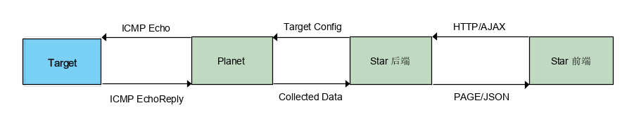
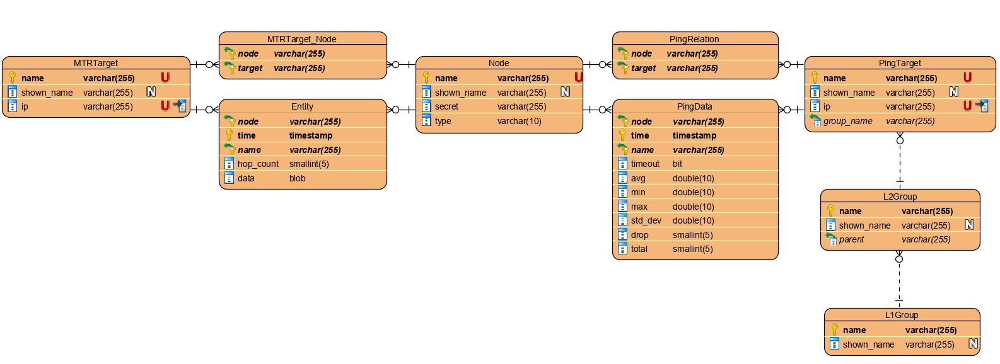

# 系统架构技术规格

## 总体架构设计

我们将整个系统分为两个部分：Planet（Comet）和Star，其中，Star部分又分割为前端和后端两个部分。各个部分的任务如下：  

| 模块 | 用途 |
| --- | --- |
| Planet | 运行于测试节点上，收集到目标的延迟和路由信息 |
| Comet | （可选，行为极类似于Planet）运行于目标上，收集到测试节点的反向路由信息 |
| Star（后端） | 收集来自Planet的数据，管理数据库，提供API和警告服务，运行HTTP服务 |
| Star（前端） | 用户界面，向后端请求数据，绘制延迟图像，展现路由信息 |

## Planet(Comet) 设计

Planet与Comet极为相似，差距仅在角色不同，Comet只使用Planet的部分功能，故下文仅详细介绍Planet，Comet则仅作简单解释。

Planet端负责向目标节点发送和接收ICMP数据包，由于Planet端潜在数量多，可能运行在的设备类型十分广泛，这就要求我们的程序能够在多种不同的系统环境下运行，而且尽可能不需要其他依赖。（在某些特殊的嵌入式设备上，系统软件包的版本和支持情况都十分复杂，难以保证兼容）在这样的要求下，我们选择了使用Golang语言编写Planet端。Golang语言是一门编译语言，可以直接生成静态链接到所有依赖的可执行程序，不需要在目标运行系统上再额外安装其他依赖。此外，Golang进行跨平台交叉编译十分方便，与C/C++不同不需要额外安装和配置复杂的交叉编译环境，有利于我们拓宽的Planet端支持运行的平台。（如大量的硬路由使用的是ARM/MIPS架构的CPU，Planet端可以在这些嵌入式设备上运行而不需要额外启动一台x86架构的机器）

Golang为网络编程提供了大量的支持，且独特的语言设计能够高效地管理大量的并行任务，极为适合我们的项目用途。

Planet的工作主要有三：
 1. 收发ICMP数据包，并计算从发送到接收的延迟
 2. 根据每轮数据包发送得到的结果，计算统计数据。
 3. 将收集计算后得到的数据发送给Star端。
 
Comet与Planet类似，区别在于Comet不收集延迟信息（延迟信息为双程延迟，与何方发送请求无关），仅搜集路由信息（去程与回程的路由常有不一致，收集反向路由信息有一定的意义）。

## Star 设计

### 后端

Star后端是整个系统的核心，需要完成多个功能。以下是Star后端的工作：

 1. 提供上报接口，接收Planet收集到的数据。  
 2. 管理数据库，包括写入记录数据、处理旧数据。  
 3. 管理系统配置，处理Planet节点、测试目标以及节点和目标的关联的增加与删除，并同步数据库。  
 4. 提供RESTful API，供前端部分调用，返回需要的数据。  
 5. 提供静态文件服务器，Serve前端文件。  

对于Star后端我们选择了Python语言作为编程语言，因为Python简单易用，适合快速开发。数据库我们选择了PostgreSQL，一是Python社区PostgreSQL使用者众多，相关库较多；二是PostgreSQL许可证较为宽松，适合于各种用途。不过我们也尽量降低了数据库与其它部分的耦合，使用其他数据库实现相同的功能，亦可以在使本系统运行。

Web服务器我们选择使用Tornado，因为我们做的是前后端分离的程序，后端只需要提供使用JSON的API和静态文件服务器，不需要在后端进行模板渲染，因而不需要大型网页框架。此外Tornado还拥有Websocket支持，可以作为将来系统的一个优化方向。

后端又分为三个部分：

 1. 数据收集与分析部分：负责接收上报的数据，并检测汇报数据异常  
 2. 系统管理部分：提供系统配置管理相关工具
 3. 网页部分：提供网页公开API和静态页面服务
 
数据库ER图设计如下：  

### 前端

To Be Filled...

 本作品采用<a rel="license" href="http://creativecommons.org/licenses/by-sa/4.0/">知识共享署名-相同方式共享 4.0 国际许可协议</a>进行许可。