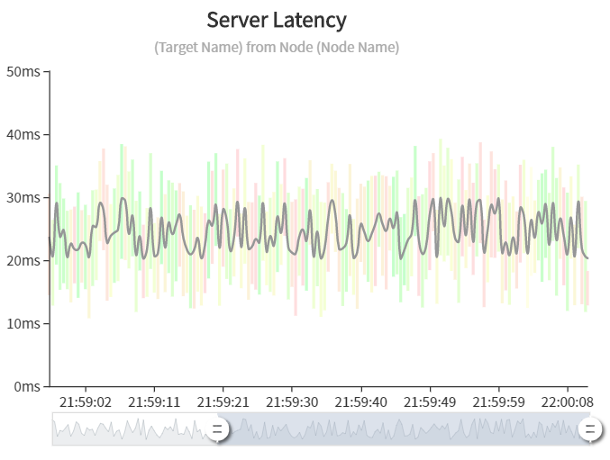

#原型展示与改进记录

针对用户的需求，我们对核心功能——图表绘制制作了原型，并展现给了用户，以了解用户对数据展现形式的需求。下面是原型的截图：

用户对图表无抖动（注：此处的抖动指诸如界面刷新时画面变白然后重新呈现内容的情况）动态更新和缩放支持很满意，但是对图表的表现形式提出了一些要求。因为当出现网络故障时，ping延迟应当是发生突变而不是渐变，所以不应当使用折线图将点连接起来。

此外，用户也提出了另外的要求，希望能对收集到的数据进行监视，当发生异常情况时（具体的判定标准可以用户自行编写），能够以一些方式通知用户。我们改进了需求文档，添加了这一需求。