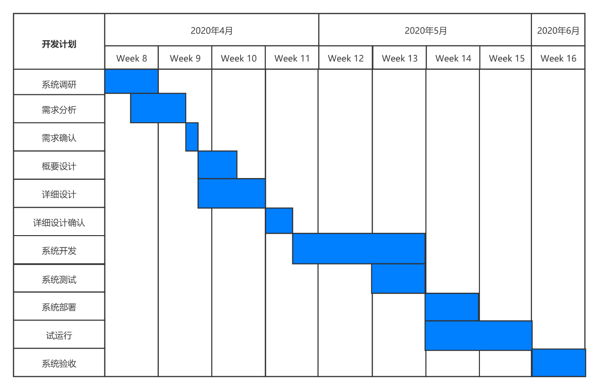

# 项目进度安排

## 一、软件开发甘特图

## 二、功能点（FP）任务分配

### 第一阶段:planet

|  | 任务名称 | 计划时间 | 安排人员 |
|--------------|----------------------|----------|----------|
| 数据收集模块 | ICMP  数据包收发 | 3 天 | 童源 |
|  | 统计数据计算 | 1 天 | 向泽楷 |
|  | 定时器 | 1 天 | 王旭 |
| 数据上报模块 | 数据上报协议格式设计 | 1  天 | 童源 |
|  | 自动重试上报队列 | 1  天 | 童源 |

### 第二阶段:Star后端  

|   | 任务名称   | 计划时间   | 安排人员    |
|--------------|----------------------|----------|----------|
|数据库   | 数据库表设计   | 1天   | 苏荣    |
|   | 数据操作SQL语句设计   | 1天   | 苏荣    |
|数据上报接收模块   | 上报数据校验   | 1天   | 王旭    |
|   | 数据存储   | 1天   | 王旭    |
|公开API接口   | 接口数据格式   | 1天   | 向泽楷    |
|   | 编写RESTful API   | 2天   | 向泽楷    |
|旧数据维护   | 定时压缩旧数据服务   | 7天   | 童源 |

### 第三阶段:Star前端  

| | 任务名称 | 计划时间 | 安排人员    |
|--------------|----------------------|----------|----------|
|界面设计 | 界面原型设计 | 1天 | 向泽楷    |
| | HTML/CSS 界面实现 | 3天 | 王旭    |
|图表设计 | 图表库-JS框架绑定 | 1天 | 向泽楷    |
| | 设计绘图风格 | 1天 | 苏荣    |
| | 动态绘图数据拉取/更新 | 2天 | 王旭    |
| | 路由追踪数据呈现 | 3天 | 童源    |
|网页功能设计 | 响应式界面设计 | 2天 | 童源    |
| | 单页式应用 | 2天 | 王旭 |

 本作品采用<a rel="license" href="http://creativecommons.org/licenses/by-sa/4.0/">知识共享署名-相同方式共享 4.0 国际许可协议</a>进行许可。
